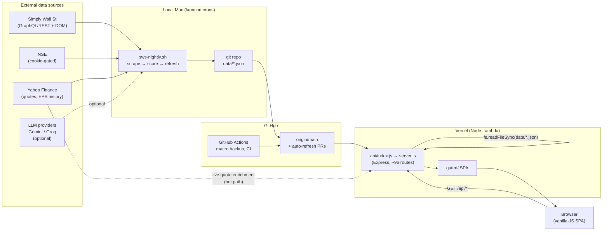
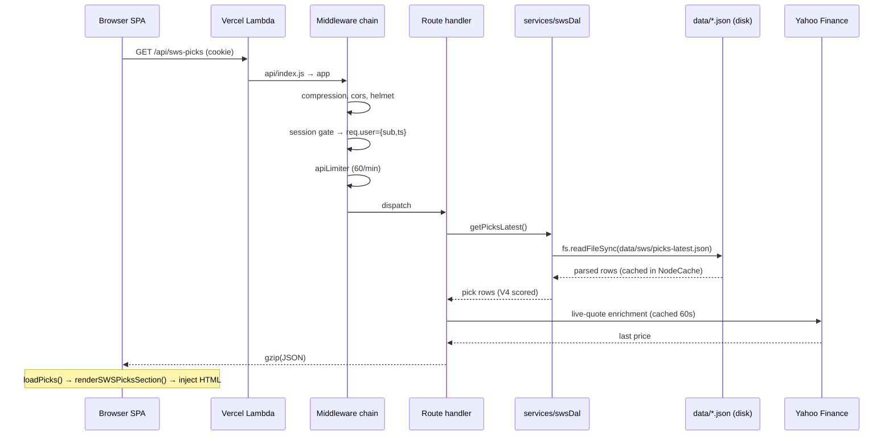
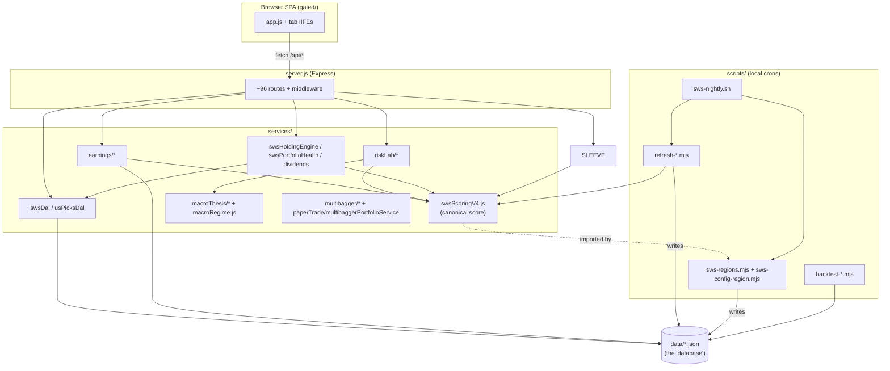

# ARCHITECTURE.md — stock-platform

Deep design + architecture reference. This is the "how and why it's built" companion to
the two lighter context files:

- **[AGENTS.md](../AGENTS.md)** — fast tool-agnostic overview (stack, layout, conventions). Start there if you're new.
- **[docs/PROJECT_STATUS.md](PROJECT_STATUS.md)** — living "what's shipped / in-flight" snapshot.
- **[CLAUDE.md](../CLAUDE.md)** — Claude-specific multi-agent working patterns.

This file goes deeper than AGENTS.md: the load-bearing design decisions, the request
lifecycle, the V4 scoring internals, the India + US picks forks, the nightly data
pipeline, every analytical subsystem, and the trade-offs behind each. Read it when you're
about to change something structural and want to understand what you'll break.

> **Last updated: 2026-05-24.** Refresh the relevant section when you change the stack,
> the scoring math, the pipeline sequence, the auth model, or add a subsystem.

---

## Table of contents

1. [System overview](#1-system-overview)
2. [Core architectural principles](#2-core-architectural-principles)
3. [Runtime topology](#3-runtime-topology)
4. [Request lifecycle & middleware stack](#4-request-lifecycle--middleware-stack)
5. [Auth & access model](#5-auth--access-model)
6. [HTTP API surface](#6-http-api-surface)
7. [Frontend architecture](#7-frontend-architecture)
8. [The SWS scoring engine (V4)](#8-the-sws-scoring-engine-v4)
9. [Multi-market picks (India + US forks)](#9-multi-market-picks-india--us-forks)
10. [Data ingestion pipelines](#10-data-ingestion-pipelines)
11. [Analytical subsystems](#11-analytical-subsystems)
12. [Data layout (`data/`)](#12-data-layout-data)
13. [Testing & CI](#13-testing--ci)
14. [Module dependency map](#14-module-dependency-map)
15. [Key design decisions & trade-offs](#15-key-design-decisions--trade-offs)
16. [Glossary](#16-glossary)

---

## 1. System overview

**stock-platform** (a.k.a. **starbhai**) is a single-tenant Indian equity research and
recommendation platform. It is **not a brokerage** — it never places a trade or moves money.
It ingests fundamentals from Simply Wall St (SWS), NSE, and Yahoo Finance; scores stocks on a
deterministic 100-point composite; generates SEBI-RA-style narratives; predicts earnings
reactions; classifies the macro regime; and backtests every signal before surfacing it.

The whole system is built around one unusual choice: **there is no database.** All persisted
state is JSON files committed under `data/`. Data is scraped/computed on a **local Mac** (because
NSE blocks datacenter IPs and the SWS scrape needs a logged-in browser session), committed to git,
and **Vercel serverless just serves the committed JSON.** Vercel never originates ingestion.



**One-line mental model:** *local scrapes commit JSON to git → Vercel reads JSON from disk and
serves a vanilla-JS SPA → the SPA fetches read-only JSON APIs, enriched with live Yahoo quotes.*

---

## 2. Core architectural principles

These are the decisions everything else hangs off. Violating them is how you break the platform.

1. **JSON-on-disk is the database.** No Postgres, no ORM. Reads are `fs.readFileSync` wrapped in
   in-process `NodeCache`. The repo *had* a Neon Postgres mirror (`services/swsDal/sqlBackend.js`);
   it was decommissioned (#345, 2026-05). Reads now go through `services/swsDal/` over the
   `jsonBackend` only. **If you see SQL/Neon code, it's dead.**

2. **Local ingestion → commit → Vercel serve.** NSE rejects Vercel datacenter IPs on its
   cookie-source endpoint (`nse.js:76-83`), and the SWS scrape needs a real browser session. So
   *every* cookie-gated scrape runs locally, writes JSON, and commits. Vercel `/api/cron/*` routes
   may flush in-process caches but must **never** originate NSE/SWS traffic.

3. **Graceful degradation — no keys required to run.** Anthropic / OpenAI / Groq / Gemini keys are
   all optional. Every LLM call falls back: a provider chain, then a deterministic keyword
   heuristic that never throws. The site renders fully with zero keys; keys only raise data fidelity
   during refreshes.

4. **The composite score is deterministic.** The SWS V4 score is pure arithmetic over scraped
   fields — no LLM in the scoring path. LLMs only produce *qualitative* side-signals (earnings
   bias, macro-regime label, risk-text agreement) that are surfaced separately, never folded into
   the headline score. This keeps the score reproducible and backtestable.

5. **Every signal is backtest-gated.** A signal doesn't get to lift confidence or size a position
   until its backtest clears an explicit gate (e.g. the earnings V1 cap-lift gate: ≥30 resolved,
   ≥55% bucket hit-rate, Brier <0.20). Until the gate clears, the signal ships at conservative caps.

6. **Test unproven ideas in isolation, never in-place.** New/experimental signals ship as **new
   files + new tabs** (US picks, Risk Lab, Sector Outlook, 5x Lab), importing
   the proven scorer rather than editing it. The India + US pipelines are explicitly *frozen* — each
   is its own fork that imports the proven scorer. This is why the codebase has many parallel tabs.

7. **Honest framing over hype.** Return/strategy surfaces carry base-rate + pre-mortem framing
   (e.g. 5x Lab states a <10% base rate in its own UI copy). Disclaimers live once, site-wide, in
   `#sebiSiteFooter` — don't duplicate them inline.

---

## 3. Runtime topology

| Environment | What runs | Entry point |
|---|---|---|
| **Vercel (prod)** | Express app as a Node.js **Lambda** (not Edge). Serves the SPA + read-only JSON APIs. | `api/index.js` (3 lines: `import app from "../server.js"; export default app;`) |
| **Local dev** | `node server.js` → `app.listen(PORT=3000)`. The `if (!process.env.VERCEL)` block runs NSE warmup + local macro refresh; never reached on Vercel. | `server.js` |
| **Local launchd crons** | The data pipelines (scrape, score, macro, earnings). See §10. | `scripts/sws-nightly.sh`, `scripts/refresh-macro-only.sh` |
| **GitHub Actions** | Backup macro refresh (heuristic-only, no secrets) + CI (smoke + unit + a modal-render e2e job). | `.github/workflows/*.yml` |

`vercel.json` bundles `gated/` and the regional `data/sws-*/deep-*.tar.gz` tarballs into the
function via `includeFiles` so static files and deep briefs are reachable inside the Lambda rather
than only from the CDN edge.

**Production URL:** `https://starbhai-stock-platform.vercel.app` (branded Vercel alias). The latest
`stock-platform-<hash>-…vercel.app` deployment URL rotates per push. `starbhai.com` is out of
scope for this platform; do not configure it in Vercel, OAuth, CORS, metadata, or shared app links.
Always link `https://starbhai-stock-platform.vercel.app`.

---

## 4. Request lifecycle & middleware stack

The middleware order in `server.js` is canonical — re-ordering it breaks things (e.g. compression
must come first so the ~5 MB `/api/sws-picks` payload fits under Lambda's sync limit).

```
 1. compression()                      gzip everything first (5 MB picks JSON → <1 MB)
 2. NodeCache instances initialised    quote 60s, historical 300s, news 120s, search 300s,
                                        catalyst 7200s, portfolio 30s, analyzer 1800s, macro 7200s
 3. cors()                             allowlist: branded Vercel alias, -gamma, localhost:3000/4011, preview regex
 4. helmet()                           CSP (unsafe-inline for ~28 onclick handlers), frameguard,
                                        HSTS, COOP same-origin-allow-popups (for OAuth popups)
 5. trust proxy = 1                    so rate-limiters see real X-Forwarded-For IPs
 6. requireApiKey  /api/portfolio      X-API-Key vs STARBHAI_API_KEY (no-op if env unset)
 7. requireApiKey  /api/watchlist      same
 8. stockDetailLimiter  /api/stock/    30 req/min, keyed by req.user.sub or IP
 9. auth routes (pre-gate)             /api/auth/google[/callback], /api/auth/me, /api/logout
10. SESSION GATE                       verify HMAC starbhai_session cookie → req.user={sub,ts}
                                        (exempt paths bypass — see §5)
11. apiLimiter  /api/                  60 req/min/user; skipped when NODE_ENV=test
12. express.static("gated/")           SPA files (gated so the CDN doesn't bypass Express)
13. express.static("public/")          login.html only (intentionally CDN-served, pre-session)
14. express.json()                     body parsing
15. route handlers                     ~96 route patterns (see §6)
```

A typical authenticated read:



**Caching layers (two tiers):**
- *Server-side* `NodeCache` per concern (TTLs above). The `analyzerCache` (30 min) is keyed by the
  `sessionId` returned from `/api/portfolio/analyze`, so `/api/portfolio/optimize` reuses the ~30s
  enrichment pipeline instead of re-running it.
- *Client-side* module-level globals in the SPA (see §7) — these are a frequent source of "stale
  data" surprises.

**Write paths** (user records, watchlist, portfolio, track snapshots) go through `userStorage.js`,
which abstracts the backend: **`@vercel/kv`** in production, a local flat file (`users.json` /
equivalent) in dev. Note the nuance vs principle #1: Vercel KV is dead *for the picks/fundamentals
read path* (#195 ripped it out — reads come from disk JSON), but KV is still the **user-scoped write
store**. "KV is dead" is true only of the data-serving read path.

---

## 5. Auth & access model

`AUTH_ENABLED` is **true iff all four** env vars are set: `STARBHAI_SESSION_SECRET` (≥64 hex chars,
enforced at startup), `GOOGLE_CLIENT_ID`, `GOOGLE_CLIENT_SECRET`, `GOOGLE_OAUTH_REDIRECT_URI`. If any
is missing (local dev / Playwright), the session gate calls `next()` unconditionally — i.e.
`AUTH_ENABLED=false` is the *absence* of config, not a separate flag.

**Session token:** `base64url("sess:" + JSON.stringify({sub, ts})) + "." + sha256-hmac-hex`,
verified with `timingSafeEqual`, 30-day TTL. Cookie `starbhai_session; HttpOnly; SameSite=Lax;
Secure` (Secure on Vercel only). `SameSite=Lax` (not Strict) so Google's OAuth redirect-back keeps
the cookie.

**OAuth flow (PKCE):**
1. `GET /api/auth/google` → generate PKCE verifier/challenge + random `state` → sign both into a
   short-lived (`10 min`) `starbhai_oauth` cookie → redirect to Google consent.
2. `GET /api/auth/google/callback` → verify the `starbhai_oauth` cookie, match `state`, exchange
   `code` with the PKCE verifier, verify the ID token issuer + `email_verified`, upsert the user in
   `userStorage`, set `starbhai_session`, redirect to `returnTo`.

**Access tiers** (this area is in flux — verify in `server.js` before relying on it; see
PROJECT_STATUS):

| Tier | Mechanism | Gates |
|---|---|---|
| **Public** | session-gate exempt list | `/`, `/login.html`, `/healthz`, `/api/auth/*`, `/api/logout`, `/api/macro/regime/health`, all `/api/cron/*`, `/api/track/migrate` + `/api/track/snapshot-sws-now` (own `MACRO_OVERRIDE_TOKEN` gate) |
| **Signed-in** | session gate (any valid Google session) | Everything not listed elsewhere. India Market, Earnings Watch, Risk Lab, Macro, Sector Outlook, News, Track Record, Portfolio Analyzer, US read routes, and 5x Lab. |
| **Admin** | in-handler `isAdmin` check recomputed from hard-coded owner email `mtaluja11@gmail.com` | `/api/admin/*`; SWS write/refresh routes via `requireAdminForSwsRefresh` (`/api/sws-refresh/*`, `/api/sws-scan/initial-start`). |

**Rate limiting:** `apiLimiter` (60/min) + `stockDetailLimiter` (30/min), key from
`services/apiLimiterKey.js` (`req.user.sub` → else IP). Both `skip` when `NODE_ENV=test` so the
Playwright harness doesn't trip them.

> **Auth summary.** Users/admin and SWS write routes are owner-only; read-only research tabs are
> signed-in surfaces. Re-read `server.js` before changing auth-sensitive routes.

---

## 6. HTTP API surface

~96 route patterns in `server.js`, grouped by feature. All are read-only JSON except the handful of
mutation routes noted. Backing modules in the right column.

| Feature area | Representative routes | Backing module(s) |
|---|---|---|
| **Auth** | `GET /api/auth/google[/callback]`, `GET /api/auth/me`, `POST /api/logout` | `google-auth-library`, `userStorage.js` |
| **Stock detail / search** | `GET /api/search`, `GET /api/stock/:symbol` | `stockList.js`, `analysis.js`, `fundamentals.js`, Yahoo chart API |
| **Market data** | `GET /api/market`, `/api/market-calendar`, `/api/market-verdict`, `/api/sector-heatmap`, `/api/fii-dii` | `nse.js`, `fundamentals.js`, `services/externalApiBreaker.js` |
| **News / catalysts** | `GET /api/news/market`, `GET /api/catalysts/today` | `stockNews.js`, `sentiment.js`, `services/catalystsService.js` |
| **Macro regime** | `GET /api/macro/regime`, `/api/macro/regime/health` (public), `/api/macro/override` (token) | `macroRegime.js`, `services/macroRegimeStorage.js` |
| **India Market** | `GET /api/sws-picks`, `/api/sws-universe`, `/api/sws-stock/:ticker`, `/api/sws-scan/status`, `/api/sws-pdf/latest` | `services/swsDal/`, `data/sws/` |
| **SWS refresh** (admin-write) | `POST /api/sws-refresh/{quick,earnings,full}`, `/api/sws-scan/initial-start` | writes `data/sws/refresh-requested.json`; launchd/skills pick it up |
| **US Market** | `GET /api/us-picks`, `/api/us-stock/:ticker`, `/api/us-scan/status` | `services/usPicksDal.js`, `data/sws-us/` |
| **Portfolio Analyzer** | `POST /api/portfolio/analyze` (multer upload), `/analyze/rerun`, `GET /api/portfolio/stance/:symbol`, `POST /api/portfolio/optimize` | `swsPortfolioAggregate.js`, `swsHoldingEngine.js`, `portfolioIntelligence.js`, `xirrOptimizer.js` |
| **Portfolio (basic)** | `GET/POST /api/portfolio`, `GET/POST/DELETE /api/risk-profile` | `portfolioParser.js`, `userStorage.js` |
| **Earnings Watch** | `GET /api/earnings/upcoming[/stats]`, `/api/earnings/:symbol`, `/api/earnings/{calibration,backtest}`, `/api/audit/earnings/:symbol/:date` | `services/earnings/earningsWatchService.js`, `earningsHistoryArchive.js`, `hitRateSummary.js` |
| **Risk Lab** | `GET /api/risk-lab/{picks-adjusted,regime-context,quality-flags[/:ticker],macro-thesis}` | `services/riskLab/*`, `data/risk-lab/` |
| **Track record** | `GET /api/track/{history,stats,sections,calibration,export.csv}`, `POST /api/track/snapshot[-sws-now]`, `/api/track/migrate` | `paperTrades.js`, `services/trackRecord/*` |
| **5x / Multibagger Lab** (personal) | `GET /api/multibagger/{overview,candidates,portfolio}` | `services/multibagger/*` |
| **Sector Outlook** | `GET /api/sector-outlook/{latest,healthz}` | `data/sectorOutlook/outlook-latest.json` |
| **Surveillance / Governance** | `GET /api/surveillance/{status,list}`, `/api/governance/{status,:symbol}` | `surveillance.js`, `governance.js` |
| **F&O / OI** | `GET /api/fo/oi-screener` | `services/foScreener.js`, `services/foBhavcopyFetcher.js` |
| **Health / admin** | `GET /api/health`, `/healthz` (public), `/api/admin/users[/:sub/portfolio.xlsx]`, `/api/admin/combined-shadow-diff` | file-age checks, `userStorage.js`, `services/combinedScore.js` |
| **Cron / diagnostics** | `GET /api/cron/{warm-caches,refresh-surveillance,refresh-governance,refresh-fo-oi,refresh-earnings}` | cache/admin refresh handlers; local nightly remains canonical for NSE-blocked surveillance data |
| **Misc / legal** | `POST /api/telemetry`, `/legal/grievance`, `/legal/charter`, `/methodology`, `/api/disclosures/holdings` | inline handlers, `gated/*.html` |

---

## 7. Frontend architecture

A **vanilla-JS SPA** with no framework and no build step. `gated/index.html` (~5,275 lines) is one
document embedding every tab panel as a hidden `<div>` (`display:none`, toggled by `switchTab()`).

**Script load order matters** (later scripts depend on globals from earlier ones):

| File | Loading | Role |
|---|---|---|
| `utils/formatIndianNumber.js` | sync | INR formatting |
| `glossary.js` | sync | term definitions |
| `app.js` | **sync, ~13,040 LOC** | the monolith — everything below isn't in a separate file |
| `swsV2Render.js` | sync | augments the SWS picks banner |
| `earnings.js` | defer | Earnings Watch IIFE → `loadEarningsWatch()` |
| `riskLab.js` | defer | Risk Lab IIFE → `loadRiskLab()` |
| `multibaggerLab.js` | defer | 5x Lab IIFE → `loadMultibaggerLab()` |
| `sectorOutlook.js` | defer | Sector Outlook IIFE → `loadSectorOutlook()` |
| `keyboard.js` | defer | WAI-ARIA roving-tab keyboard nav |

> **`gated/app.js` is a 13,040-LOC monolith — DO NOT parallelise edits to it.** Concurrent edits
> collide. Edit sequentially, one logical section per commit. Its major sections (marked by
> `// ===`): init+telemetry, auth header menu (`auth.init()` sets `window.__starbhai_isAdmin`),
> snapshot/LLM health banners, glossary tooltips, market data, search,
> stock detail, dashboard, tabs (`TAB_CONFIG` + `switchTab()` + `LABS_MENU_TABS` "More" dropdown),
> Users, Portfolio, Market News, Track Record, Watchlist, price chart, Portfolio Analyzer,
> India Market, US Market, the SWS deep-brief modal, the action-list modal, the universal stock modal, and
> the hash router (`#tab=<name>`).

**Tab visibility:** the tab bar keeps every read-only research tab in the main row for signed-in
users, including 5x Lab. Users remains owner-admin-only. Risk Lab
and Sector Outlook are visible but locally toggleable via `localStorage`.

**Client-side caches (the "why am I seeing stale data" list):**

| Cache | Where | TTL | Gotcha |
|---|---|---|---|
| `_analyzerCache` | `app.js` module-level | 60s | Shared across tab switches; a re-open within 60s re-renders the stale object. Nulled on upload/rerun error. |
| `_newsDigest` | `app.js` module-level | until next `loadMarketNews()` | Filter re-renders use the cached digest, not a fresh fetch. |
| `_earningsSnapshot` / `_earningsStats` | `earnings.js` IIFE | until next `loadEarningsWatch()` | Filter-bar re-renders don't re-fetch; Refresh button clears them. |
| `searchClientCache` | `Map`, FIFO, max 50 | session | Cross-tab; a stale query can persist until evicted by 50 newer queries. |

> **e2e note:** because these caches are module-level globals, Playwright specs that share
> `gotoApp()` state can race. Don't parallelise specs across the *same* tab. Picks-tab currency
> assertions must read `.sws-pick-card` `textContent` (not container `innerText`, which only sees
> accordion chrome).

---

## 8. The SWS scoring engine (V4)

This is the heart of the platform. As of #437 (merged to main, 2026-05), **V4 is the sole composite
score and V3 is deleted.**

- **Canonical math:** `services/swsScoringV4.js` (`computeV4Score`, `_fvCompositeV4`,
  `verdictV4FromScore`). `scripts/swsScoringV4.mjs` is a thin re-export so both region scorers
  (India + US) and the server share identical arithmetic.
- **Version string:** `sws-v4.1-100pt-2026-07` (v4.1 = the 2026-07 Health↔Future pillar-weight swap + growth-trap brake; see below).
- **Orchestrator:** `services/swsScoring.js#scoreStock` calls `computeV4Score`; it also still
  computes legacy V1/V2 fields for back-compat, builds the leaderboard, and categorises stocks.

### The 100-point composition

Input is `stock.overview.snowflake` — the SWS "Snowflake," 6 axes each rated 0–6. V4 uses **4 of
the 6** (Management isn't scraped; **Dividends was dropped in V4** — still shown in the UI's
Snowflake/30 total and the `dividend_aristocrats` category, but contributes **0** to the composite).

| Block | Max pts | How |
|---|---|---|
| **Pillars** | **76** | `health/6×20 + future/6×22 + valuation/6×18 + past/6×16` (v4.1: H/F swapped from 22/20) |
| **FV composite** | **12** | coverage-renormalised weighted avg of value sub-signals that are present |
| **Momentum** | **12** | `1Y_pctile×7 + 3M_pctile×3 + 1M_pctile×2` |
| **Risk overlay** | **−15 → 0** | penalties only (never positive) |
| **Final** | **0–100** | `clamp(round(pillars + fv + momentum + overlay, 1), 0, 100)` = `v4_score_100` |

**FV composite detail (`_fvCompositeV4`):** present sub-signals are coverage-renormalised; missing
sub-signals are not imputed to zero:
- *Analyst upside* (weight 8): from `overview.upside_pct`, bucketed (≥30%→1.0, ≥15%→0.75, ≥0%→0.5,
  ≥−10%→0.25, else 0). **MAX-inflation haircut:** if `fair_value_inr ≈ fair_value_range.max` with
  ≤5 analysts, dock 0.25 buckets (guards against the analyst-range-max-as-consensus trap).
- *Relative P/E* (weight 4): `multiples.pe / industry_benchmarks.pe` (≤0.8→1.0, ≤1.2→0.5, else 0).
  Only ~9% universe coverage.
- Missing analyst FV/upside → use the industry-average FV composite from analyst-covered peers
  when that peer bucket has enough coverage; otherwise fall back to neutral **6/12**. Both paths
  set `fv_imputed=true`; industry-average fills also set `fv_industry_imputed=true`.

**Momentum detail:** percentile ranks against sorted universe distributions in
`data/sws/v3-universe-stats.json` (loaded via `loadV3Universe()` / `dal.getV3UniverseStats()`).
Missing universe → imputed 50th percentile.

**Risk overlay:** NSE GSM −15, ASM-short −12, ASM-long −10; falling-knife (1M < −25% AND health ≤
2/6) −5; catalyst-chase (1M > +30% AND valuation ≤ 2/6) −3; **V4-only value-trap brake** (3M < −20%
AND health ≤ 3/6 AND valuation ≥ 4/6) −4 (skipped if falling-knife already fired); **v4.1 growth-trap
brake** (1M ≤ −15% AND future ≥ 5/6) −4 — the future-tilt's mirror of the value trap; skipped if
falling-knife fired, but MAY deliberately stack with the value-trap brake (−8).

### Verdicts are ABSOLUTE, not rank-based

This is the central V4 design change. Cutoffs are **frozen percentile snapshots** of the 2026-05
India universe — no runtime band-loading:

| Verdict | Score | ≈ India percentile |
|---|---|---|
| `TOP_PICK` | ≥ 59 | ~92nd |
| `STRONG` | ≥ 47 | ~75th |
| `ACCEPTABLE` | ≥ 37 | ~50th (median) |
| `WATCH` | ≥ 28 | ~25th |
| `AVOID` | < 28 | — |

Why absolute: the holding engine, on-demand `/api/sws-stock`, and `categoriseStock` never load
universe bands. Under the old rank-based scheme they'd silently return null and collapse the action
ladder. (V4 scores run *lower* than V3 — median ≈ 37 — so every downstream gate was remapped.)

**Action ladder (`swsHoldingEngine.js#scoreBandAction`, exact `<` cutoffs — scores round to 1
decimal):** `<18` EXIT · `<28` Reduction-50% · `<37` Reduction-25–33% · `<47` HOLD · `<53`
Top-up-modest · `<59` Top-up · `≥59` STRONG Top-up (top-ups gated on position-weight /
sector-weight / upside guards). The Portfolio Analyzer
(`computeRecommendationV2`) layers hard overrides + a liquidity-tier gate on top of this.

### The retained "v3" names are aliases — they carry V4 data

When you grep, you'll find `v3` everywhere. **This is intentional, not a leftover algorithm.** The
migration kept the field/bus names to avoid churn; they now carry V4 values:

| Surviving name | Reality |
|---|---|
| `signals.v3.{v3_score_100,v3_verdict,v3_breakdown}` (earnings bus) | V4 data; `v3SignalAdapter.js` reads `row.v4_breakdown`/`row.v4_score_100` and returns them under `v3_*` keys |
| `top_ranked_30_v3` (picks-latest section key) | V4-scored rows |
| `data/sws/v3-universe-stats.json` (+ regional) | filename unchanged; holds `{r1m,r3m,r1y}` arrays for **momentum percentiles only** (no longer used for verdicts) |
| `loadV3Universe()` | back-compat alias → `dal.getV3UniverseStats()` |
| `PREDICTOR_VERSION = "earnings-predict-v3-2026-05"` | predictor now runs on V4 inputs |
| `services/trackRecord/calibration.js` V3 anchor table | scores *historical* pre-migration trades only; returns `null` for V4 trades (honest "no estimate yet") |

> **Do not blindly rename `v3`→`v4`.** These are live, load-bearing aliases. Renaming is pure churn
> and risks breaking the earnings bus. Only the *prose* comments calling v3 "the 50%-coverage-gated
> scorecard" are stale.

### Honest caveat (design rationale)

V4's 4-year look-ahead backtest **trails V3** (XIRR ~58% vs 66%, Sharpe ~1.75 vs 2.05). It shipped
anyway because V4 adopts a cleaner relative-FV-upside model and fixes structural V3 failure modes
(coverage compression, the absent-FV trap). **Post-migration weight tuning is the stated path to
recover the gap** — the score is deliberately tunable via `sws-backtest-weight-sweep.mjs` rather
than frozen. The migration also incidentally fixed three latent bugs (a `swsScoring` ReferenceError
on every AVOID stock, a `swsSectorFit` crash in the Analyzer's Sector Gap Spotlight, an empty
multibagger `catalystComposite` stream) and a follow-up (#438) fixed a stock-modal crash from a
leftover `hasV3` reference; #439 added a CI modal-render e2e job to catch such regressions.

**v4.1 (2026-07) — the first weight tuning actually landed.** A point-in-time re-rank backtest
(`scripts/backtest-pillar-reweight.mjs`, 38 archived daily snapshots) found the Health↔Future swap
(H22/F20 → H20/F22, valuation untouched — every valuation-cut variant lost) beat the old weighting
on hit-rate AND median alpha at both 21d and 30d holds. Promoted to live with a new **growth-trap
brake** (future ≥5/6 + 1M ≤ −15% → −4). Evidence is single-regime (~10-week bull window); cutoffs
were kept frozen (accepted ~−179 STRONG+/−30 TOP_PICK). The candidate lab that produced it lives at
`services/swsScoringV4Shadow.js` + `/shadow-lab.html` (never edits the live scorer).

---

## 9. Multi-market picks (India + US forks)

There are two equity-picks markets: **India** (primary) and **US**. Each is its own fork:

1. **India** is the primary pipeline — `data/sws/` namespace, the full nightly chain (§10).
2. **US was a hard fork** (#379/#386). New `data/sws-us/` namespace; US scorer/parser **import** the
   India ones, never edit them; cloned `$`-currency render path.

Both forks import the canonical scorer (`services/swsScoringV4.js`) rather than editing it, so the
score arithmetic stays identical across markets. The server side keeps them separate:
`services/usPicksDal.js` serves the US read routes (`/api/us-picks`, `/api/us-stock/:ticker`,
`/api/us-scan/status`) against `data/sws-us/`, mirroring the India `services/swsDal/` path.

### The region registry (`scripts/sws-regions.mjs` + `sws-config-region.mjs`)

`sws-regions.mjs` still exports a `REGIONS` map, but it now carries **only `in` and `us` reference
entries** — kept for documentation/completeness and any future migration. India and US each run
their **own fork** in production, NOT a generic registry-driven pipeline. Each entry documents the
region-varying facts:

- `sitemapRegion`, `sitemapShardCount`, `sitemapShardUrl(i)` — how to crawl SWS's public sitemap into `universe.json`
- `exchangeTokens`, `excludedExchangeTokens`, `exchangePriority` — which SWS exchange tokens make the market
- `tickerKey(exch, id)` — the canonical dotted ticker. India/US = bare uppercased ids.
- `currencyIso`, `currencySymbol`, `currencyDecimals` — stamped on every pick for UI formatting (₹/$)
- `mcapFloorNative`, `smallcapCeilingNative` — in local currency
- `dataDir`, `profilePrefix`, `routePrefix`, `tabId`, `domPrefix` — namespacing knobs
- `applyBseFilter`, `surveillanceEnabled`, `nseCalendar` — India-only flags

`makeRegionConfig(code)` (in `sws-config-region.mjs`) constructs the region's `PATHS`/`UNIVERSE`,
then spreads in India's region-agnostic knobs (timing, rate caps, human-fingerprint, panic signals).

**Co-run guard (`sws-corun-guard.sh`):** India and US share **one SWS account** and one
`cf_clearance` cookie. Running two scrapes concurrently doubles ban exposure and contends on the
Chrome profile lock. India's `sws-refresh-api.sh` and US's `sws-refresh-us.sh` both source the guard
and abort (exit 5) if the other market's scraper is live.

**Tarball packing:** each market's `deep/*.json` (thousands of files) is packed into a single
`deep-<code>.tar.gz` for Vercel serving — avoids the platform's ~15k source-file cap (#393).

The US market ships **empty** until scraped. Refresh is manual: `/sws-refresh-us` (skill). Narrate/PDF
deferred for the US region.

---

## 10. Data ingestion pipelines

**Everything that touches NSE/SWS runs on the local Mac, writes JSON, and commits.** Vercel serves.

### The nightly chain (`scripts/sws-nightly.sh`)

launchd (`com.starbhai.sws-nightly.plist`) fires it once daily at **00:30 IST** after SWS's rolling India updates have settled.
Logs to `data/sws/sws-nightly.log`. Ordered steps (✗ = fatal):

| # | Step | Script | Writes | Gate / timeout |
|---|---|---|---|---|
| 1✗ | Pre-flight | panic-flag, battery, `ping 8.8.8.8` | — | exit 3/4/5 |
| 2✗ | Git sync | `git fetch` + `checkout -B sws-nightly-base origin/main` + autostash | — | exit 5 |
| 3✗ | SWS scrape + score | `sws-refresh-api.sh` (`SWS_AUTO_PR=0`) | `data/sws/{deep/*,picks-latest,last-refresh,sws-scored-universe,v3-universe-stats}.json` | ~1h |
| 3b | News | `sws-news-scrape.mjs` | `data/sws/deep/<T>.json#news[]`, `news-latest.json` | — |
| 3c | Catalysts batch | `refresh-catalysts` · `refresh-nse-corporate` · `refresh-dividends` · `refresh-nse-index-constituents` · `refresh-fo-oi` · `sws-universe-from-sitemap --merge` · macro-freshness check · `refresh-fundamentals` · `refresh-surveillance` · `refresh-governance` | `data/catalysts/*`, `data/nse-fo/oi-deltas-latest.json`, `fundamentals.json`, `surveillance.json`, `governance.json`, universe files | 8h/144h/264h gates; per-step timeouts |
| 3d | Fundamentals history | `refresh-fundamentals-history.mjs` (Yahoo per-quarter EPS) | `fundamentalsHistory.json` | **18h gate**, 2400s |
| 3e | Earnings Watch | `refresh-earnings.mjs` | `earnings-watch-latest.json`, `earnings-watch-stats.json`, `llm-signal-cache.json`, `earnings-history/<date>.json` | 600s |
| 9 | Resolve actuals | `resolve-earnings-actuals.mjs` | `earnings-history/<date>.json#actual_*` | 300s |
| 9a | 5x strategy | `refresh-5x-strategy.mjs` | `data/strategy/multibagger-*.json` | 120s |
| 9b | Risk Lab | `refresh-risk-lab.mjs` | `data/risk-lab/picks-adjusted-latest.json` | 60s |
| 9d2/3 | Sector news + outlook | `refresh-sector-news-themes` · `refresh-sector-outlook` | `data/sectorOutlook/*` | 900s (≤400 LLM calls) |
| 4✗ | Sanity gate | `sws-sanity-gate.mjs` | `data/sws/_sanity/_latest.json` | exit 7 → data-only PR |
| 4b | Coverage drift | `coverage-gap-analysis.mjs --refresh-sme` | `data/coverage/*` | — |
| 5✗ | Commit + push | branch `chore/sws-auto-refresh-<date>-<time>` | — | exit 8 |
| 6✗ | PR + auto-merge | `gh pr create` + `gh pr merge --squash --auto` | — | merges after CI green |

Non-fatal steps log a warning and continue. If the sanity gate fails, SWS picks are held back but
the auxiliary refreshes still ship in a `chore(data): non-SWS refresh …` PR.

**`data/macroRegime.json` is a single-writer exception** — deliberately excluded from the nightly
commit. Its only writers are the standalone `com.starbhai.macro-only` launchd job (every 2h IST) and
the `refresh-macro-regime.yml` GitHub Actions backup (every 4h, heuristic-only). #402 extended this
single-writer rule to `data/macro-headlines/` + `data/macroRegime-history/`.

### Scrape mechanics

- **API scraper** (`sws-api-scrape*.mjs`, current prod path): hits SWS's GraphQL/REST directly,
  ~1h for ~5,500 stocks. The legacy **DOM scraper** (Playwright) took 3+ days.
- **Sharding:** each region's `universe.json` splits by `index % 3` into 3 independent Node
  processes, spawned with a 15s stagger. Per-shard progress persists to `progress-api-<N>.json`
  after every stock → resumable with `SWS_RESUME=1`; up to `SHARD_MAX_RETRIES` (default 2) auto-retries.

### Refresh cadences

| Job | Schedule | Runs |
|---|---|---|
| `com.starbhai.sws-nightly` (launchd) | 00:30 IST daily | full pipeline above |
| `com.starbhai.macro-only` (launchd) | every 2h IST | `data/macroRegime.json` only |
| `refresh-macro-regime.yml` (GH Actions) | every 4h | heuristic-only backup macro PR (`automation/macro-backup`) |
| `ci.yml` (GH Actions) | on push/PR | smoke + unit + modal-render e2e |

**Auto-refresh PRs flood the repo** — `chore(macro): auto-refresh …` and `chore(sws): auto-refresh
…` open every few hours. They commit data, not code; don't be alarmed by the volume.

There are ~18 `refresh-*.mjs` scripts and ~20 `backtest-*.mjs` scripts; **9 of the backtests are
concentration/horizon forks** (`backtest-top{1,2,3,5}-3yr`, `backtest-concentration-{1,5,10}yr`,
etc.) — forks of one logic, propagate fixes by hand.

---

## 11. Analytical subsystems

### 11.1 Earnings predictor (`services/earnings/*`)

The most complex subsystem. Flow:

```
earningsCalendarBuilder.buildCalendar(events-latest.json)   → IST-dated, deduped, fiscal_quarter-tagged events
  → signalAggregator.aggregateSignals(event, ctx)           → joins SWS deep + V4 breakdown (via v3SignalAdapter)
                                                               + fundamentalsHistory (EPS YoY) + announcements + deals
  → earningsLlmBatcher.batchLlmSignals(events)              → only if V4 score ≥ 47 (floor); else heuristic
                                                               Gemini → Groq → keyword heuristic; hash-cached
  → earningsPredictor.predictCalendar(events)               → 11 component scorers (below) → BEAT/INLINE/MISS + confidence
  → priceBandBuilder (±15% Bull/Base/Bear)
  → earningsRationaleNarrator (3-paragraph deterministic)
  → reactionPlaybook (9-cell verdict × guidance matrix)
  → earningsHistoryArchive.archivePredictions             → data/catalysts/earnings-history/<date>.json (schema v4)
  → earningsHealth.buildHealthSummary                      → data/catalysts/earnings-health.json
```

**11 component scorers** (each returns `{pts, why}`): V4 future+past (±18), V4 valuation (±8), V4
risk overlay (0→−10), pre-result run-up (±15), sector momentum (±10), EPS YoY trajectory (±15),
FV-upside fallback (±8), last-quarter echo (±4), NSE announcements (±10), bulk/block deal flow (±7),
LLM qualitative signal (±10), missing-data penalty (0→−6). Final `score_100 = clamp(50 + Σ, 0, 100)`;
thresholds (frozen): MISS `<34`, BEAT `≥56`, else INLINE; confidence capped 50–65% (V1).

**Backtest loop:** `actualsIngester.js` resolves `actual_*` (SWS news primary, Yahoo fallback,
keyed to fiscal-quarter end to dodge IST/EST off-by-one). `backtest-earnings-predictions.mjs` reports
hit-rate / Brier / the **V1 cap-lift gate** (≥30 resolved + ≥55% bucket hit-rate + Brier <0.20, on
the latest predictor version only). `weightTuner.js` does a multiplier sweep with walk-forward CV
but **never edits the predictor** — it only recommends, and refuses until a stricter gate (≥80
resolved, ≥2 quarters, ≥5 sectors × ≥10 events). LLM untrusted-text passes through
`llmPromptHardener.js` (sanitise + delimiter-wrap).

### 11.2 Risk Lab (`services/riskLab/*`)

`labOrchestrator.buildLabPayload(picks, regime)` runs two independent, defensive lenses per stock,
writing `data/risk-lab/{picks-adjusted,quality-flags}-latest.json`:

- **Macro lens** (`macro/adjustedScorer.js`): stock sector → regime impact (`sectorTemplates.js`);
  multi-sector stocks take worst case; soft delta `impact×2.5×(severity/3)×confidence×0.5` capped
  ±5; **hard veto** when `severity≥4 AND worst_impact≤−3 AND verdict==TOP_PICK`; stale regime
  (>12h) treated as CALM (zero adjustment).
- **Quality lens** (`quality/qualityScorer.js`): 5 null-safe sub-scorers —
  `consecutiveMissDetector` (prior-Q miss regex over `news[]`), `imputationPenalty`
  (`fv_imputed`/`momentum_imputed`), `riskTextClassifier` (`risks[]` vs debt/governance/fraud
  taxonomy), `counterThesisParser` (falsification triggers), `sectorQualityOverlay`. 0 flags = HIGH,
  1–2 = MEDIUM, 3+ = LOW; veto → `QUALITY_HOLD`.

Earnings Watch consumes this read-only via `earningsLabView.js` (attaches `lab_view` to each event).

### 11.3 Macro Thesis (`macroRegime.js` + `services/macroThesis/*`)

`macroRegime.js` classifies into **10 regimes** (WAR_ESCALATION/DE_ESCALATION, OIL_SHOCK,
RATE_HIKE/CUT, CURRENCY_WEAKNESS, POLICY_STIMULUS, REGULATORY_SHOCK, GLOBAL_RISK_OFF, CALM) over **20
canonical sectors**, via Gemini → Groq → keyword-heuristic. Each regime has hardcoded
`sectorImpacts[]` (−4…+4). Output: `data/macroRegime.json`.

`thesisOrchestrator.js` builds the thesis package: current regime + `daysInState` → catalyst
proximity → `scenarioProbabilityEngine` (4 branches: continue/escalate/de-escalate/new-shock, base
probs modulated by severity+daysInState+catalyst, normalised to 1.0) → `historicalAnalogFinder`
(joins live history + backfill seeds → forward-return distributions at +7/14/30/60d, warns when
n<3) → per-branch sector beneficiary/loser ranking → SEBI Reg-16 caveats (n_analogs, indeterminate
flags, 10%-per-thesis cap).

### 11.4 Portfolio Analyzer (`services/swsHoldingEngine.js`, `swsPortfolioHealth.js`)

Upload XLSX (ticker/qty/avgPrice) → per holding: `scoreStock` (V4) → `evaluateHardOverrides`
(GSM=EXIT, position >35%=Reduction-50%, severe FV downside, 2-of-4 weakness stack) → crosscheck +
catalyst + Indian-risk + last-earnings + peer-substitute + audit-trail → `computeRecommendationV2`
(action ladder) → `gateActionByTier` (liquidity gate). **Portfolio Health Score**
(`swsPortfolioHealth.js`): 7 earned-points components (Quality 25 / Valuation 15 / Diversification
15 / Concentration 10 / Risk 15 / Loss-control 10 / Macro 10), HHI for sector diversification, hard
caps for severe concentration/surveillance/pledge, grades A (≥85) → E (<40).

**Dividends to capture** (`services/dividends/swsDividendsExtractor.js` +
`services/portfolio/portfolioDividendService.js`): zero-network — walks `data/sws/deep/*.json` for
`news[].keyDevTypeId ∈ {45,46,47}`, regex-parses DPS/exDate/recordDate/payDate from templated SWS
bodies, joins to holdings, computes hold-by date / ₹ payout / yield-on-cost. Refresh:
`scripts/refresh-dividends.mjs` → `data/catalysts/dividends-upcoming.json`.

### 11.5 Retired sleeves

Compounder Lab and Earnings Edge shipped as isolated experimental sleeves in #337 and were retired
in June 2026. Their tabs, read APIs, refresh scripts, shared sleeve paper-trade harness, promoter-PIT
feed, generated data, and tests were removed to reduce surface area and nightly load.

Retired deep links (`#tab=compounder`, `#tab=earningsEdge`) intentionally fall back to India Market
and canonicalize to `#tab=picks`. Generic Track Record paper-trade storage and 5x Lab infrastructure
remain active and separate.

---

## 12. Data layout (`data/`)

| Path | Holds | Serves |
|---|---|---|
| `data/sws/` | India `picks-latest`, `sws-scored-universe`, `v3-universe-stats`, `deep/*` (~5.5k), `deep.tar.gz`, `universe*`, `news-latest`, `_sanity/` | India Market (primary) |
| `data/sws-us/` | US `picks-latest`, `deep/*`, `deep-us.tar.gz`, `universe`, `us-index-constituents` | US Market |
| `data/catalysts/` | `events-latest`, `nse-announcements-rolling`, `nse-bulk-block-rolling`, `earnings-watch-latest`+`-stats`, `earnings-history/<date>`, `llm-signal-cache`, `dividends-upcoming`, `earnings-health`, `predictor-weights-v1` | Earnings Watch, dividends |
| `data/macroRegime.json` | current regime + severity + provider + `generatedAt` | macro banner (all tabs) |
| `data/macro-headlines/`, `data/macroRegime-history/` | headline archive, regime snapshots | macro history (single-writer) |
| `data/risk-lab/` | `picks-adjusted-latest`, `quality-flags-latest`, `macro-thesis-latest` | Risk Lab |
| `data/strategy/` | `multibagger-scores-latest`, `catalyst-slate-latest`, `multibagger-health-latest` | 5x Lab |
| `data/sectorOutlook/` | `outlook-latest`, `classified-news/*.jsonl`, `llm-theme-cache` | Sector Outlook |
| `data/paper-trades/` | active Track Record/paper-trade artifacts | Track Record |
| `data/nse-fo/` | `oi-deltas-latest`, `bhavcopy/`, `history/<T>` | F&O OI screener |
| `data/coverage/` | coverage-gap audit, ground truth, SME/Emerge | universe coverage QA |
| `fundamentals.json`, `fundamentalsHistory.json`, `surveillance.json`, `governance.json` (repo root) | NSE fundamentals, Yahoo quarterly EPS, ASM/GSM, shareholding | stock modals, predictor trajectory, risk flags |

---

## 13. Testing & CI

- **Unit:** Node's built-in test runner. **153** `test/*.test.mjs` files on disk; `npm test` runs a
  long `&&`-chained list (no glob) + 2 bash tests + 2 scripts-level tests. Self-skip on missing
  fixtures.
  The owner/admin identity contract is covered by `test/adminOwner.test.mjs`; signed-in lab route
  access is covered by `test/labRoutesSignedIn.test.mjs`.
- **E2E:** Playwright specs in `test/e2e/`. `npm run test:e2e` pre-builds the analyzer XLSX
  fixture + US picks fixtures, runs on **port 4011** via `webServer`, with `AUTH_ENABLED=false`
  and `NODE_ENV=test` (rate-limits off). Specs self-skip when data preconditions (admin auth, live
  prices, populated paper-trades) aren't met. Spec *ordering* matters where module-level SPA caches
  are shared (see §7).
- **Smoke:** `npm run smoke` → `scripts/smoke-imports.mjs` (ESM-resolution check, no assertions).
- **CI (`ci.yml`):** smoke + unit + a modal-render e2e job (#439, added to catch
  `renderSwsModalCore` regressions after the V4 modal-crash fix #438).
- **Backtests** double as offline correctness gates for every signal (see §10, §11).

---

## 14. Module dependency map

Layers depend downward only. Scripts and the server both read services; services read `data/`; the
SPA only talks to the server's JSON API.



**The choke point is `services/swsScoringV4.js`** — server, scripts, both markets (India + US), the
earnings predictor, Risk Lab, the portfolio engine, and the sleeves all funnel through it. Change it
and re-run the V4 unit tests (`test/swsScoringV4.test.mjs`, `test/actionLadder.v4.test.mjs`) plus the
region/backtest paths.

---

## 15. Key design decisions & trade-offs

| Decision | Rationale | Trade-off you live with |
|---|---|---|
| **JSON-on-disk, no DB** | Free Vercel tier; git is the audit log; trivial local edits | 5 MB picks payload needs gzip; "writes" are commits; concurrent cron+session writers can collide (use a worktree for risky changes) |
| **Local scrape → commit → Vercel serve** | NSE blocks datacenter IPs; SWS needs a browser session | Data freshness depends on the Mac being awake; auto-refresh PR noise |
| **Deterministic composite score; LLMs only for side-signals** | Reproducible, backtestable, no API dependency for the headline number | LLM nuance never reaches the score; qualitative signals live in separate surfaces |
| **V4 absolute verdict cutoffs (not rank-based)** | On-demand/holding paths don't load universe bands → no silent null collapse | Cutoffs are frozen 2026-05 India percentiles; universe drift isn't auto-recalibrated |
| **Shipped V4 despite a lower backtest than V3** | Cleaner relative-FV model, fixes coverage/absent-FV traps, tunable | Live XIRR/Sharpe gap until weight tuning recovers it |
| **Kept `v3` field/bus names as V4 aliases** | Renaming 80+ files is pure churn and risks the earnings bus | Grep is misleading; future readers must know the names lie |
| **US = its own fork of India** | US scorer/parser import India's, never edit them; both frozen for regression safety | A second parallel code path to keep in sync with India |
| **Experimental signals as new tabs/files** | Validate hit-rate in isolation before touching the proven scorer | Tab sprawl; ~13k-LOC app.js monolith |
| **One shared SWS account + co-run guard** | One subscription; guard prevents ban | India and US scrapes are serialised — no parallel market refresh |
| **Backtest-gated confidence** | Don't oversell an unproven signal | Earnings confidence capped 50–65% until the gate clears (months) |

---

## 16. Glossary

- **SWS** — Simply Wall St, the upstream fundamentals provider (scraped, not API-partnered).
- **Snowflake** — SWS's 6-axis 0–6 rating (Value, Future, Past, Health, Dividend, Management). V4
  scores 4 of the 6.
- **V4** — the current 100-pt composite score (`swsScoringV4.js`, `sws-v4.1-100pt-2026-07`). Replaced
  V3 in #437. Pillars 76 + FV 12 + momentum 12 − overlay ≤15.
- **FV** — fair value. `upside_pct` = (FV − price)/price. Beware: `fair_value_inr` is sometimes the
  analyst-range *max*, not consensus — V4 applies a haircut; cross-check the deep brief.
- **Verdict** — TOP_PICK / STRONG / ACCEPTABLE / WATCH / AVOID, by absolute V4 cutoff.
- **Action ladder** — EXIT → Reduction → HOLD → Top-up → STRONG Top-up, keyed to V4 score bands.
- **Cap-lift gate** — the bar an earnings backtest must clear before confidence caps rise (≥30
  resolved, ≥55% bucket hit-rate, Brier <0.20).
- **Deep brief** — `data/sws/deep/<TICKER>.json`: the full SWS payload (snowflake, news[], risks[],
  rewards[], fiscal history, FV). The richest per-stock source on disk.
- **Region registry** — `sws-regions.mjs` config map, now holding only `in`/`us` reference entries
  (kept for documentation and any future migration; India and US each run their own fork).
- **Co-run guard** — `sws-corun-guard.sh`, prevents the India and US scrapes from sharing the one SWS
  account concurrently.
- **The nightly chain** — `sws-nightly.sh`, the launchd-driven scrape→score→refresh→PR pipeline.
